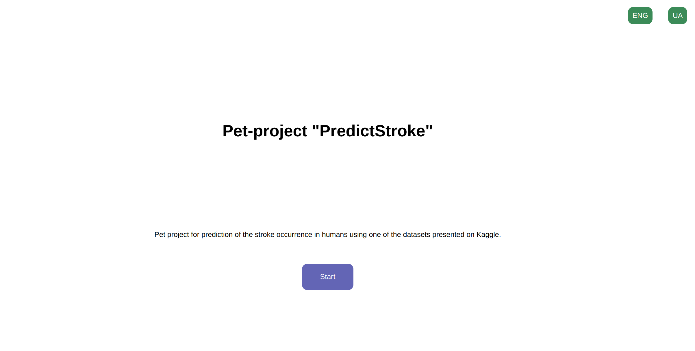
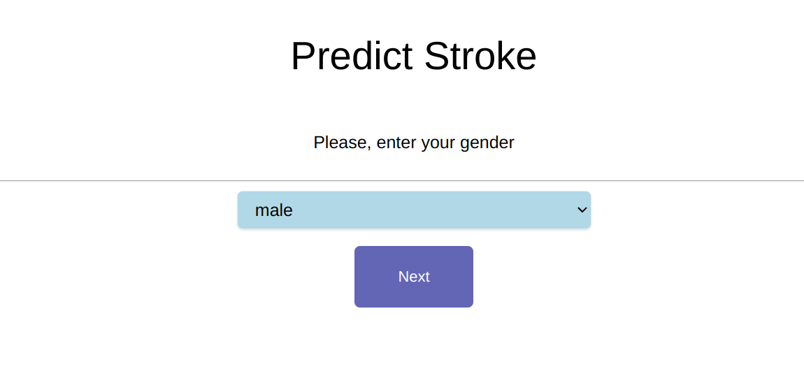
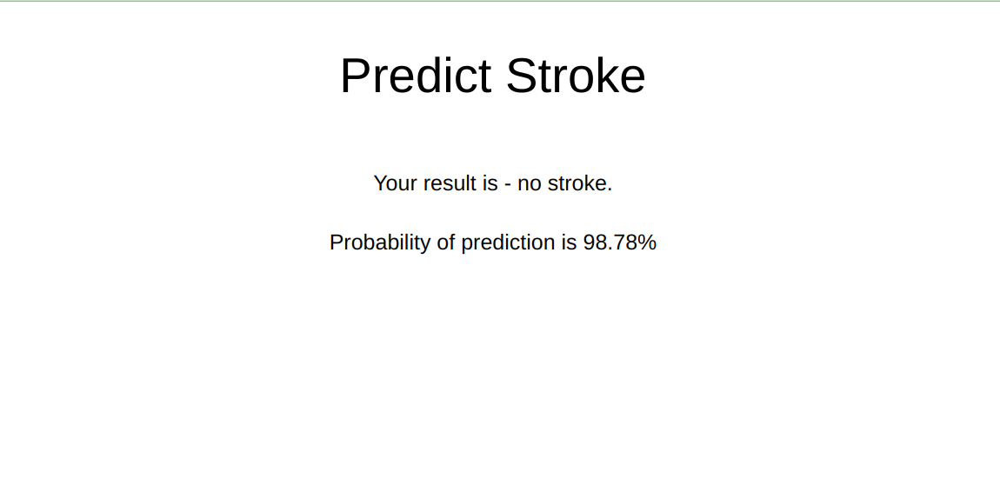

# Stroke Prediction Django Project
#### My pet-project for Kaggle dataset “Stroke Prediction” , where you should predict the probability of stroke occurrence in humans (<i>Link for dataset is presented below</i>)
<br>https://www.kaggle.com/datasets/fedesoriano/stroke-prediction-dataset </br>
<br><b>Kaggle Notebook: https://www.kaggle.com/code/skashperova/stroke-prediction-xgboost/ </b>
## Description
<br> This is a pet project whose main goal was to create a web application for predicting the probability of a person having a stroke based on 10 features 
- gender, age, hypertension, cardiovascular diseases, average blood glucose level, family and work status, place of residence, height, weight and smoking.</br>
<br>I decided to create a web-site where the user could enter the above data. Since not everyone knows their average blood glucose level, 
I decided not to include this feature in the list of respondents, but to try to predict its value using the fuzzy extrapolation method. </br>
<br>I created Kaggle notebook (kernel) to explain all my actions with data. I also added table of content, where you can find description of dataset, EDA, data preprocessing, modeling and evaluation.
In the process of exploratory data analysis. I visualized the relation between percentages of people who had a stroke and categorical features, 
I visualized the distributions of numerical features and made some important conclusions about it.
The gradient boosting algorithm XGClassifier from XGBoost was chosen as a model for solving the competition. 
In addition, I paid attention to tuning model during training. </br>
<br>ROC accuracy = 0.86 </br>
<br><b>Libraries for data visualization: </b>Altair, Seaborn, Matplotlib</br>
<br><b>Libraries for data preprocessing and modeling: </b>  Pandas, Numpy, Scikit-Learn, XGBoost</br>
<br><b>Python frameworks: </b>  Django</br>

## Screenshots
<br>Below are a few screenshots of the web application view, as well as instructions for launching. You can test application on 2 languages: Ukranian and English<br>
<br>Main view of Django application</br>

<br></br><br>Example of user feature field</br>

<br></br><br>View of prediction result</br>

<br></br>
## Guide how to run and test project
<br>1. Clone this repository from github. </br>
<br>2. Install all necessary libraries to your virtual environment using such command as: </br>
```pip install -r requirements.txt```
<br></br><br>2. Run Django Project from stroke directory: </br>
```python manage.py runserver```
